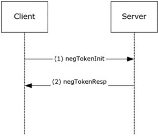
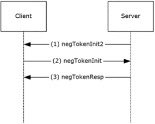

# General Security Service API (GSS) - Negotiation Mechanism (SPNEGO)

## Key data:
 - SPNEGO is a security protocol that uses a GSS-API authentication mechanism.
 - GSS–API is a literal set of functions that include both an API and a methodology for approaching authentication.
 - An application protocol is responsible for ferrying discrete, opaque packets that the authentication protocol produces.
 - These packets, which are referred to as *security tokens* by the GSS specifications, implement the authentication process.
 - **Steps**:
     1. The application protocol first invokes the authentication protocol on the client.
     2. The client portion of the authentication protocol creates a security token and returns it to the calling application.
     3. The application protocol then transmits that security token to the server side of its connection, embedded within the application protocol.
     4. On the server side, the server's application protocol extracts the security token and supplies it to the authentication protocol on the server side.
     5. The server authentication protocol can process the security token and possibly generate a response; or it can decide that authentication is complete.
     6. If another security token is generated, the application protocol must carry it back to the client, where the process continues.
 -  This exchange of security tokens continues until one side determines that authentication has failed or both sides decide that authentication is complete.
     - The onus of determining success or failure is on the abstracted security protocol, not the application protocol, which greatly simplifies the application protocol author's task.
 - The application protocol can then invoke the authentication protocol to sign or encrypt the messages that are sent as part of the application protocol.
 - The session-specific security services operations are done in much the same way, where the application protocol can indicate which portions of the message are to be encrypted, and the application protocol must include a per-message security token.
 - SPNEGO presents a GSS–compatible wrapper to other GSS mechanisms. 
 - It securely negotiates among several authentication mechanisms, selecting one for use to satisfy the authentication needs of the application protocol.
---
 ## SPNG Message Flow
 - The image below shows the SPNG message flow (Client initiated).

     

     1. The client sends a negTokenInit message to the server. This message specifies the available authentication methods and an optimistic token.
     2. The server sends a negTokenResp message to the client. The message specifies the state of the negotiation.

 - The image below shows the SPNG message flow (Server intiated).

     

     1. The server sends a negTokenInit2 message to the client. This message specifies the available authentication methods and an optimistic token.
     2. The client sends a negTokenInit message to the server. This message specifies the available authentication methods and an optimistic token.
     3. The server sends a negTokenResp message to the client. The message specifies the state of the negotiation.
---
## Messages

 - 