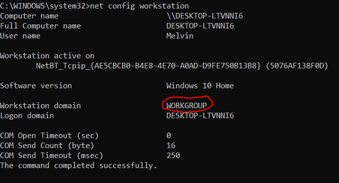
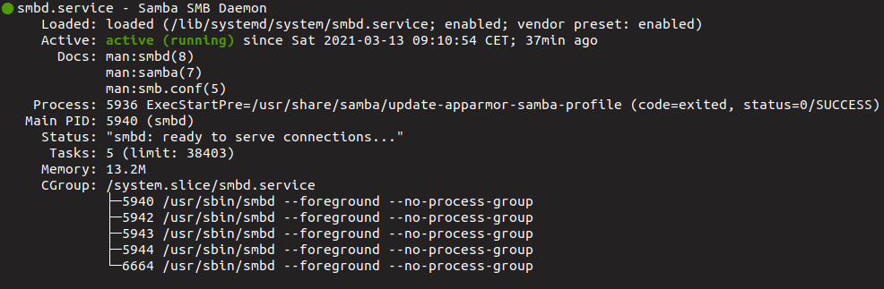
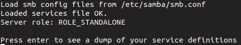
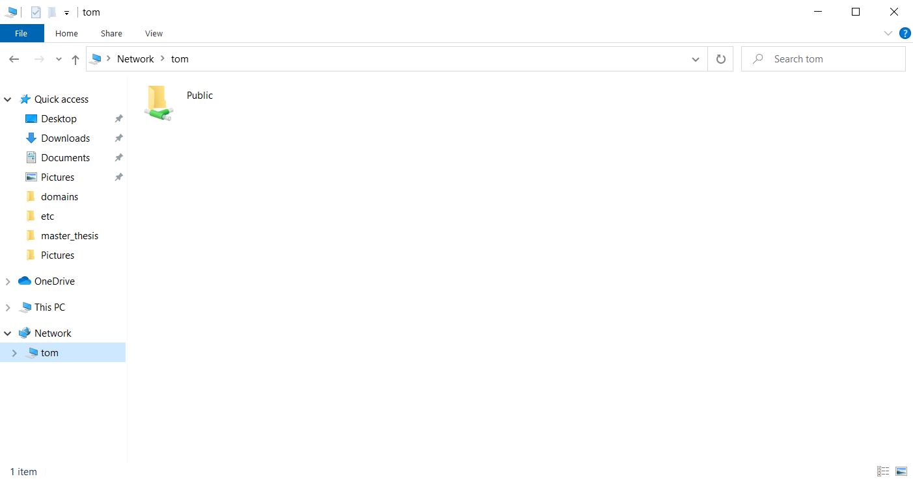
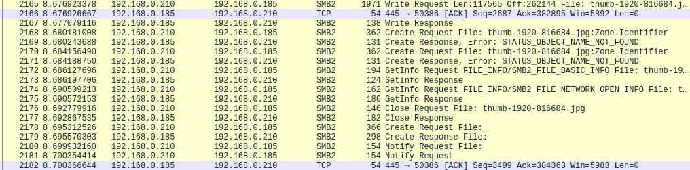

# Samba Server Setup on Ubuntu 20.04 with Windows 10 Client

## On Windows
---
**Firstly**, find out to which Workgroup the Windows machine belongs, open CMD and give the following command:
```
net config workstation
```
The output of the command should look like this:



**Secondly**, in case there is no DNS system in place, reference the IP of the Ubuntu system in the Windows hosts file. You can either call it from CMD (as shown below) or use the windows explorer:
```
notepad C:\\Windows\System32\drivers\etc\hosts
```
Then just add the Ubuntu IP and the computer name like this and save the file:
```
192.168.0.185    tom
```
**Thirdly**, enable file sharing in the Windows firewall in CMD like this:
```
netsh advfirewall firewall set rule group="File and Printer Sharing" new enable=Yes
netsh advfirewall firewall set rule group="Network Discovery" new enable=Yes
```

## On Ubuntu
---

**Firstly**, enter the hosts file like this:
```
$ sudo nano /etc/hosts
```
and add the Windows machine:
```
192.168.0.210   DESKTOP-LTVNNI6
```
---

**Secondly**, install Samba:
```
$ sudo apt update
$ sudo apt install samba
```

and quickly check if the Samba Daemon is up and running:
```
$ sudo systemctl status smbd
```
The response should look like this:



---
**Next**, configure the Samba Public Share. However, before changing the smb.conf, one should make a copy:
```
$ sudo cp /etc/samba/smb.conf{,.backup}
```
Then is can simply be opened with nano:
```
$ sudo nano /etc/samba/smb.conf
```
Now, the configuration has to be adapted to suit the user's needs. I used the following config:
```
[global]
    workgroup = WORKGROUP        # Set this to the Windows workgroup name
    server string = Samba Server
    netbios name = tom           # ubuntu pc name
    security = user
    map to guest = bad user

[Public]
    path = /samba/public         # this folder will be visible in the network
    browsable = yes
    writable = yes
    guest ok = yes
    read only = no
    create mask = 644
```

Once the config file has been saved, call the following command to whether there are no errors in the configuration:
```
$ testparm
```
The output should look like this if everything is ok:



Lastly, restart the daemon for the changes to take effect before doing the next step:
```
$ sudo systemctl restart smbd
```
---
**Next**, create the folder defined in the configuration file:
```
$ sudo mkdir -p /samba/public
```
and set the permissions so that everyone can read and write to it:
```
$ sudo chown -R nobody:nogroup /samba/public
$ sudo chmod -R 0775 /samba/public
$ sudo chgrp sambashare /samba/public
```
When this is done, restart the Daemon again:
```
$ sudo service smbd restart
```
The Public folder should now be visible under **Network** in the Windows Explorer.



# Wireshark

When everything is set up, open Wireshark:
```
$ sudo apt install wireshark # if not intalled
$ wireshark
```
and *start capturing packets*.

When files are now added or removed from the public folder from either side (Ubuntu/Windows), SMB2 packets should appear.

