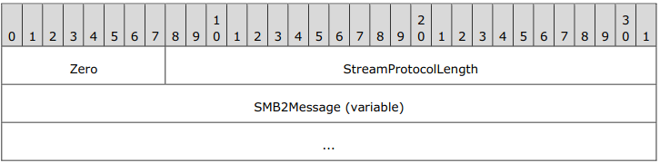
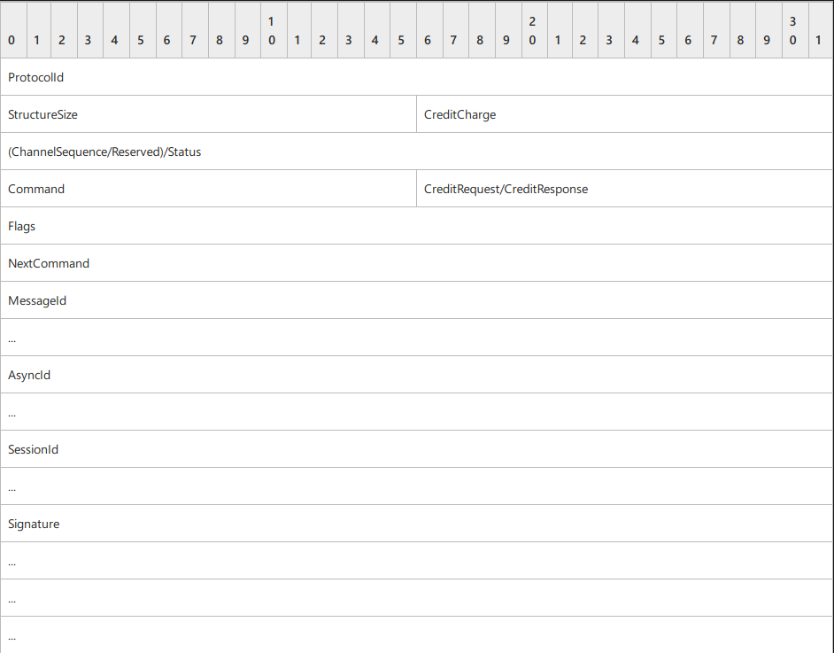
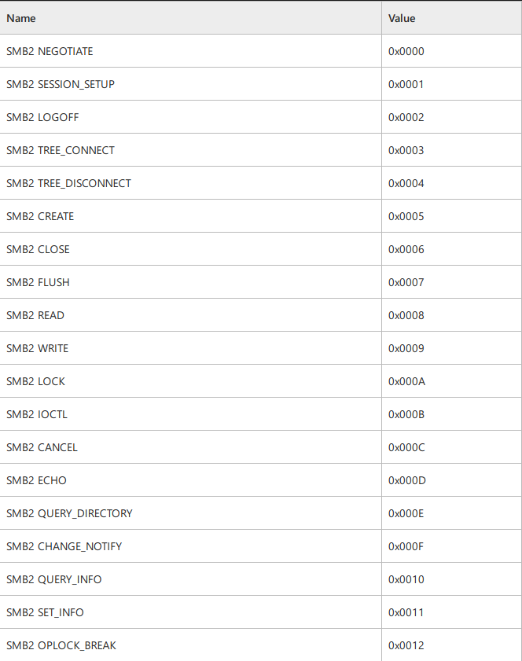
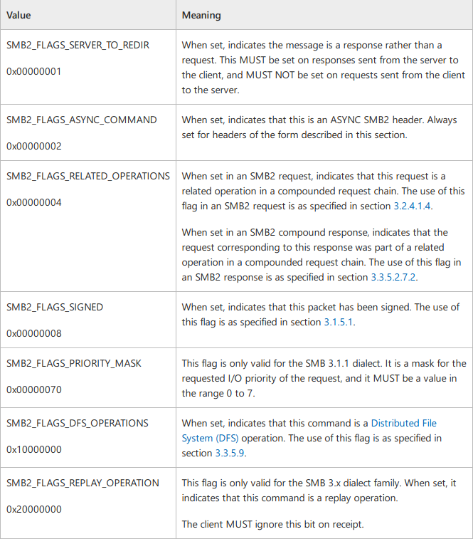
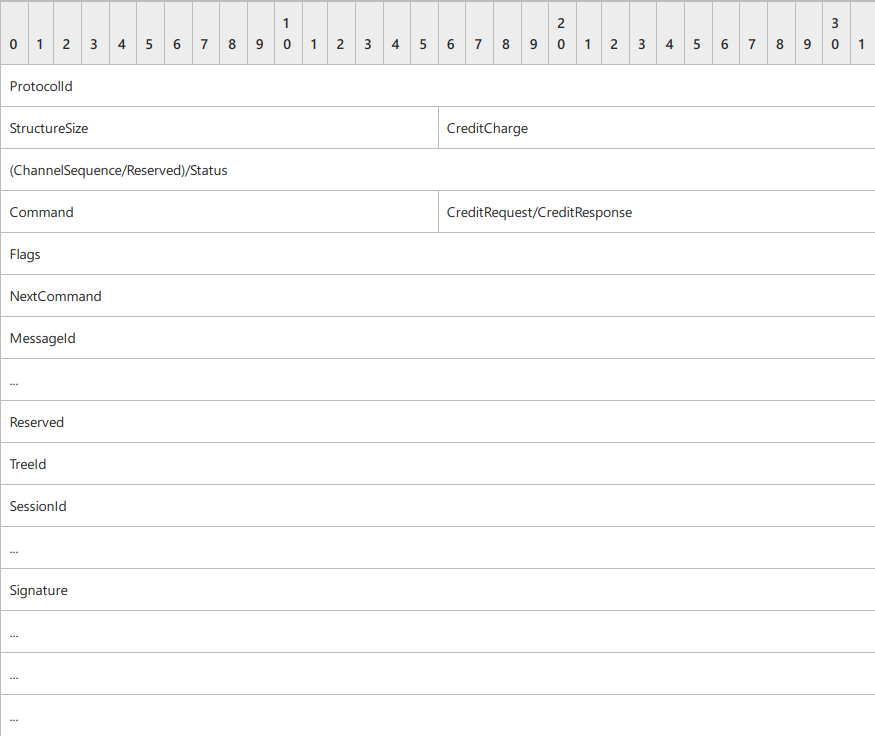

# Server Message Block Protocol Specification
## Server Message Block (SMB) Protocol Versions 2 and 3
---

## Transport
- The SMB2 protocol supports Direct TCP, NetBIOS over TCP, and SMB2 Remote Direct Memory Access Tansport
- All dialects of SMB2 support operation over Direct TCP. The Direct TCP transport packet header has the following structure.
- **Direct TCP Transport Header**:

    
    - **Zero (1 byte)**: The first byte of the header must be zero (0x00)
    - **StreamProtocolLength (3 bytes)**: The length, in bytes, of the SMB2Message in network byte order. This field does not include the 4-byte Direct TCP transport packet header; rather, it is only the length of the enclosed SMB2Message.
    - **SMB2Message (variable)**: The body. The length of an SMB2Message varies based on the SMB2 command represented by the message.
        - SMB2 dialects 2.0.2, 2.1, 3.0 and 3.0.2 allow NetBIOS over TCP.
        - SMB2 dialects 3.0, 3.0.2, and 3.1.1 allow operation over SMB2 RDMA Tansport.
    - The specific SMB2 protocol can be negotiated as the result of a multi-protocol exchange. When the SMB2 Protocol is negotiated on the connection, there is no inheritance of the base SMB Protocol state. The SMB2 Protocol takes over the transport connection that is initially used for negotiation, and thereafter, all protocol flow on that connection MUST be SMB2 Protocol.
---
## Message Syntax
- The SMB2 protocol is composed of and driven by message exchanges between the client and the server in the following categories:
    - *Protocol negotiation*: (SMB2 NEGOTIATE)
    - *User authentication*: (SMB2 SESSION_SETUP, SMB2 LOGOFF)
    - *Share access*: (SMB2 TREE_CONNECT, SMB2 TREE_DISCONNECT)
    - *File access*: (SMB2 CREATE, SMB2 CLOSE, SMB2 READ, SMB2 WRITE, SMB2 LOCK, SMB2 IOCTL, SMB2 QUERY_INFO, SMB2 SET_INFO, SMB2 FLUSH, SMB2 CANCEL)
    - *Direct access*: (SMB2 QUERY_DIRECTORY, SMB2 CHANGE_NOTIFY)
    - *Volume access*: (SMB2 QUERY_INFO, SMB2 SET_INFO)
    - *Cache coherency*: (SMB2 OPLOCK_BREAK)
    - *Simple messaging*: (SMB2 ECHO)
- The SMB 2.1 dialect enhances these categories and adds the following:
    - *Hash retrieval*: (SMB2 IOCTL)
- The SMB 3.x dialect family further enhances these categories and adds the following:
    - *Encryption*: (SMB2 TRANSFORM_HEADER)
- The SMB 3.1.1 dialect introduces:
    - *Compression*: (SMB2 COMPRESSION_TRANSFORM_HEADER)

- The **SMB2 Protocol message** is the payload packet encapsuled in a transport packet.
    - All SMB2 messages begin with a fixed-length *SMB2 header* 
    - The SMB2 header contains a *Command* field indicating the operation code that is requested by the client or responded to by the server.
    - An SMB2 message is of variable length, depending on the *Command* field in the SMB2 header and on whether the SMB2 message is a client request or a server response.
    - Unless otherwise specified, multiple-byte fields (16-bit, 32-bit, and 64-bit fields) in an SMB2 message **MUST** be transmitted in little-endian order.
    - Unless otherwise indicated, numeric fields are integers of the specified byte length.
    - Unless otherwise specified, all textual strings **MUST** be in Unicode version 5.0 format, using 16-bit Unicode Transformation Format (UTF-16) form of the encoding.
    - Unless otherwise specified, textual strings with separate fields identifying the length of the string **MUST NOT** be null-terminated.
    - Unless otherwise noted, fields marked as "unused" **MUST** be set to 0 when being sent and **MUST** be ignored when received. These fields are reserved for future protocol expansion and **MUST NOT** be used for implementation-specific functionality.
    - When it is necessary to insert unused padding bytes into a buffer for data alignment purposes, such bytes **MUST** bet set to 0 when being sent and **MUST** be ignored when received.

---
## SMB2 Header
- Header of all SMB2 protocol requests and responses
- There two variants of this header: **ASNYC** and **SYNC**
- If the *SMB2_FLAGS_ASYNC_COMMAND* bit is set in **Flags**, the header takes the form SMB2 Packet Header-ASYNC. This header format is used for responses to requests processed asynchronously by the server. The SMB2 CANCEL Request **MUST** use this format for canceling requests that have received an interim response.
- If the SMB2_FLAGS_ASYNC_COMMAND bit is not set in Flags, the header takes the form SMB2 Packet Header-SYNC.
- **ASYNC Header**:

  

    - **ProtocolId (4 bytes)**: The protocol identifier. The value **MUST** be set to 0x424D53FE, also represented as (in network order) 0xFE, 'S', 'M', and 'B'.
    - **StructureSize (2 bytes)**: **MUST** be set to 64, which is the size, in bytes, of the SMB2 header structure.
    - **CreditCharge (2 bytes)**: In the SMB 2.0.2 dialect, this field **MUST NOT** be used and **MUST** be reserved. The sender **MUST** set this to 0, and the receiver **MUST** ignore it. In all other dialects, this field indicates the number of credits that this request consumes.
    - **(ChannelSequence/Reserved)/Status (4 bytes)**: In a request, this field is interpreted in different ways depending on the SMB2 dialect. In the SMB 3.x dialect family, this field is interpreted as the *ChannelSequence* field followed by the *Reserved* field in a request.
        - **ChannelSequence (2 bytes)**: This field is an indication to the server about the client's *Channel* change.
        - **Reserved (2 bytes)**: This field **SHOULD** be set to zero and the server **MUST** ignore it on receipt. In the SMB 2.0.2 and SMB 2.1 dialects, this field is interpreted as the *Status* field in a request.
        - **Status (4 bytes)**: The client MUST set this field to 0 and the server MUST ignore it on receipt. In all SMB dialects for a response this field is interpreted as the Status field. This field can be set to any value.
    - **Command (2 bytes)**: The command code of this packet. This field MUST contain one of the following valid commands:
      
      

    - **CreditRequest/CreditResponse (2 bytes)**: On a request, this field indicates the number of credits the client is requesting. On a response, it indicates the number of credits granted to the client. 
    - **Flags (4 bytes)**: A flags field, which indicates how to process the operation. This field MUST be constructed using the following values:

      

    - **NextCommand (4 bytes)**: For a compounded request and response, this field MUST be set to the offset, in bytes, from the beginning of this SMB2 header to the start of the subsequent 8-byte aligned SMB2 header. If this is not a compounded request or response, or this is the last header in a compounded request or response, this value MUST be 0.
    - **MessageId (8 bytes)**: A value that identifies a message request and response uniquely across all messages that are sent on the same SMB 2 Protocol transport connection.
    - **AsyncId (8 bytes)**: A unique identification number that is created by the server to handle operations asynchronously.
    - **SessionId (8 bytes)**: Uniquely identifies the established session for the command. This field MUST be set to 0 for an SMB2 NEGOTIATE Request and for an SMB2 NEGOTIATE Response. 
    - **Signature (16 bytes)**: The 16-byte signature of the message, if SMB2_FLAGS_SIGNED is set in the Flags field of the SMB2 header and the message is not encrypted. If the message is not signed, this field MUST be 0.
---
- **SYNC Header**

  

    - Down to the **MessageId** all fields are equivalent to the fields in the Async Header
    - **Reserved (8 bytes)**: The client SHOULD<2> set this field to 0. The server MAY<3> ignore this field on receipt.
    - **TreeId (4 bytes)**: Uniquely identifies the tree connect for the command. This MUST be 0 for the SMB2 TREE_CONNECT Request. The TreeId can be any unsigned 32-bit integer that is received from a previous SMB2 TREE_CONNECT Response. TreeId SHOULD be set to 0 for the following commands:
        - SMB2 NEGOTIATE Request
        - SMB2 NEGOTIATE Response
        - SMB2 SESSION_SETUP Request
        - SMB2 SESSION_SETUP Response
        - SMB2 LOGOFF Request
        - SMB2 LOGOFF Response
        - SMB2 ECHO Request
        - SMB2 ECHO Response
        - SMB2 CANCEL Request
    - **SessionId (8 bytes)**: Uniquely identifies the established session for the command. This field MUST be set to 0 for an SMB2 NEGOTIATE Request and for an SMB2 NEGOTIATE Response.
    - **Signature (16 bytes)**: The 16-byte signature of the message, if SMB2_FLAGS_SIGNED is set in the Flags field of the SMB2 header and the message is not encrypted. If the message is not signed, this field MUST be 0.
